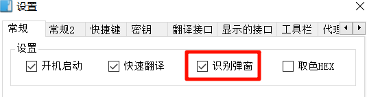
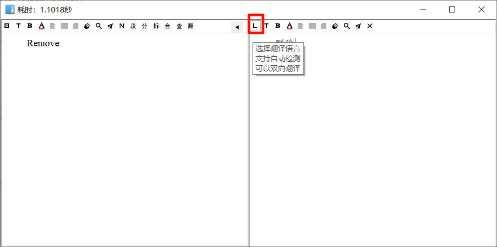
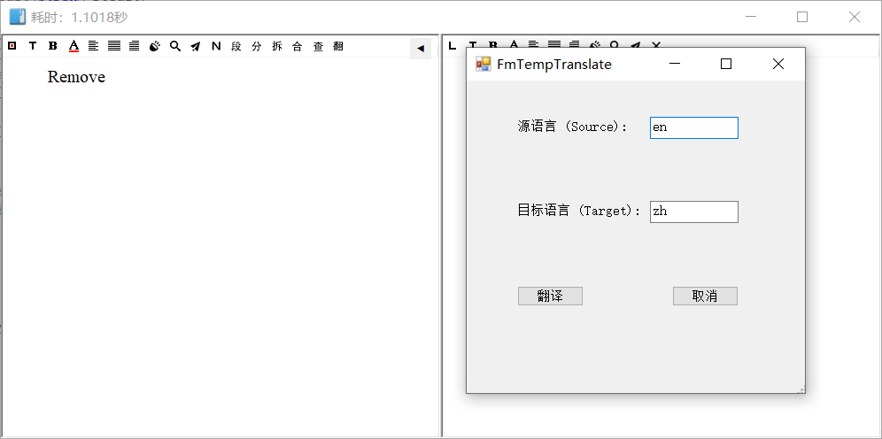
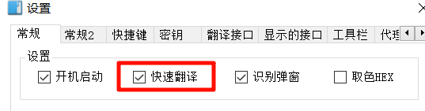
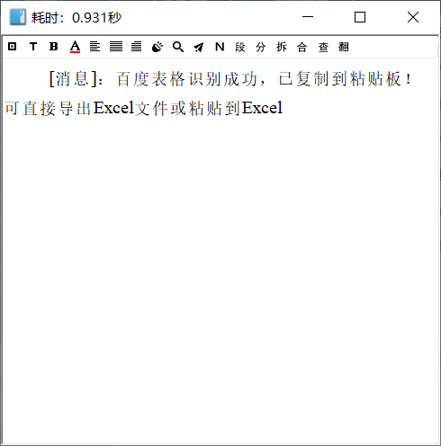
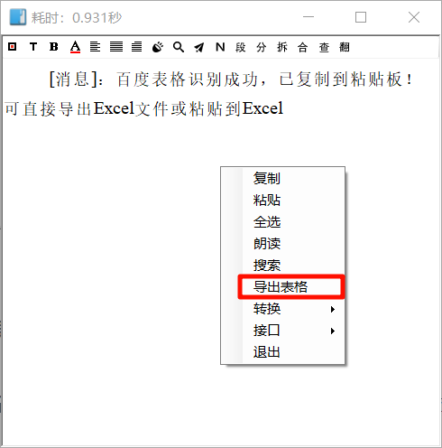

## 天若 OCR 文字识别 v6

**天若 OCR 文字识别 `v6`** ：

**全新版本，全新出发！**

基于 https://github.com/AnyListen/tianruoocr 项目进行完善制作而成。

如果能帮到你，欢迎给个 **`star`**

## 功能简介

- **天若 ocr 开源版** 是一款 **`文字识别(OCR)+翻译`** 的轻巧软件，**`v6`** 版本修复了一些旧版本的失效接口，并添加了一些新功能。功能简介如下：

### 文字识别

#### 常规识别

- **双击托盘程序图标，或使用默认快捷键 `F4`** 即可进行 **常规识别**，识别完成会弹出结果窗口。

#### 静默识别

- **静默识别指的是识别完成不弹出窗口，而是将识别结果放入剪贴板。**

- **静默识别有两种使用方式**：
- 托盘菜单选择 **"静默识别"**，或者设置快捷键后使用 **快捷键**

  - `设置 - 常规`，**取消勾选识别弹窗**，然后进行常规识别即可

    

### 翻译

#### 常规翻译

- **识别完成后手动点击工具栏的翻译按钮进行翻译**
- 翻译完成后，**如果源语言是自动检测，识别不准确导致翻译结果不对**，或者 **想临时更改源语言和目标语言重新翻译**，可以 **右键单击** 翻译窗口工具栏第一个图标在弹出的窗口输入源语言和目标语言重新翻译

#### 快速翻译

- 静默翻译：`设置 - 常规`，**勾选快速翻译**。

  鼠标光标选中文本，使用快捷键进行翻译，**默认快捷键为 `F9`**，

  翻译完成，译文自动复制在剪贴板，不会弹出窗口，如果光标选中文本的地方可以粘贴，还会自动粘贴

  

- 窗口翻译：`设置- 常规`，**取消勾选快速翻译**。

  鼠标光标选中文本，使用快捷键进行翻译，**默认快捷键为 `F9`**，

  翻译完成，会弹出窗口显示原文和译文，不会自动把译文复制到剪贴板

#### 截图翻译

- **使用托盘菜单或快捷键**，截图识别完成后自动翻译，弹出译文窗口，并可点击按钮查看原文

- 截图静默翻译：截图翻译完成后不弹出窗口，译文自动复制至粘贴板。

  开启方法：`设置 - 常规 2 - 截图翻译`，**两项设置都勾选**，然后使用截图翻译即可

  

#### 监听翻译

- **监听剪贴板** 自动进行翻译。**托盘菜单** 可快速开启和关闭监听

#### 输入翻译

- **输入文本** 进行翻译。**点击托盘菜单或使用快捷键** 进行输入翻译

## 接口说明

**软件的接口主要分为文字识别接口及翻译接口。**

### 文字识别接口

目前 **文字识别** 支持 **通用印刷体识别**，**表格识别**，**手写识别**，选择对应的接口即可。

文字识别接口有 **需要联网的在线接口**，也有 **不需要联网的离线接口**

#### 在线接口

- 除离线接口外皆为在线接口。

- 在线接口 **有些需要密钥，有些不需要密钥**

  - 需要密钥的在线接口请到 `设置 - 密钥` 查看，并自行申请密钥。

  - **密钥一般有免费额度，具体额度请查看其对应的服务商官网文档。**

    **推荐开启短信通知或余额告警**，防止免费额度消耗完毕扣费，你也可以购买接口的付费套餐。
  
- **表格识别** 请选择 **百度表格识别，腾讯表格识别** 两个在线接口，阿里表格识别暂不可用

  - 表格识别使用方法：

    选择接口识别完成后，如果成功会提示可 **直接导出 excel 或粘贴到 excel** 

    

    此时有两种方式可以获取表格：

    1. 右键菜单选择 **"导出表格"**

    

    2. `wps` 或 `excel` 新建一个表格，然后直接 `ctrl + v` 粘贴

    两种方式获取的表格的 **表格样式略有不同，数据相同，任选其一即可**。

- **手写识别** 请选择 **百度手写识别，腾讯高精度识别** 两个在线接口，也可使用 **离线接口**，前提是离线接口使用支持手写识别的模型。

- **AIOCR 接口**：支持提示词，请查看 [AI 接口指南](docs/AI接口指南.md) 

#### 离线接口

离线接口有 `PaddleOCR`，`PaddleOCR2`，`RapidOCR`  三个，**三选一即可 !!!**

离线接口区别及使用方式请查看： [离线接口指南](docs/离线接口指南.md) 

### 翻译接口

- **翻译接口均为需要联网的在线接口，同样的有些需要密钥，有些不需要密钥。**

- 需要密钥的翻译接口请到 `设置 - 翻译接口` 查看，并自行申请密钥。

- **密钥一般有免费额度，具体额度请查看对应的服务商官网文档。**

  **推荐开启短信通知或余额告警**，防止免费额度消耗完毕扣费，你也可以购买接口的付费套餐。

- 谷歌翻译接口 **需要正确的网络环境** 才能使用

- **AI 翻译接口**：支持提示词，请查看 [AI 接口指南](docs/AI接口指南.md) 

## 已知问题

- **任务管理器** 里天若的进程名在识别文本后会变为耗时时间
- 窗口文本框不支持部分`emoji`如😊😁😒，不支持的`emoji`在输入和粘贴后会被渲染成方块。同样如果翻译和识别结果里含有不支持的`emoji`，会渲染显示为方块
- ......

## 特殊设置说明

**`常规2`-`文本改变后自动翻译`** 的时间设置，单位为毫秒，输入 **正整数** 设定时间延迟，输入 `0` 则为关闭此功能，

另有高级语法：

- 正整数后输入翻译接口名，启用白名单模式，**仅这些翻译接口启用此功能**

  例如：输入 `1000,Bing,Bing2`，表示只有 `Bing`、`Bing2` 翻译接口启用文本改变后自动翻译功能，检测时间为 `1000` 毫秒

- 正整数后输入减号和翻译接口名，启用黑名单模式，**仅这些翻译接口关闭此功能**

  例如：输入 `1000,-Bing,-Bing2`，表示只有 `Bing`、`Bing2` 翻译接口关闭文本改变后自动翻译功能，其他接口开启文本改变后自动翻译功能，检测时间为 `1000` 毫秒

  注：使用高级语法时，翻译接口名前，要么都不带减号，要么都带减号，不能混写了，否则不生效。例如：

  `1000,Bing,-Bing2` 是错误写法，不会生效

## 注意事项

- 进入 **设置** 页面，修改设置后，只有关闭掉设置页面，才会保存设置
- **google 翻译** 依旧需要正确的网络环境才能使用，如果网络环境不满足，翻译结果会提示 `Translation failed: 发送请求时出错。`
- 本人是 `win10` 系统，功能测试正常，在 其他系统下可能会有一些不符合预期的表现

欢迎 `issue` 反馈及 `PR` 贡献！

##  特别鸣谢
本项目的开发离不开以下优秀开源项目的支持，感谢以下优秀开源项目的支持：

<https://github.com/AnyListen/tianruoocr>：提供了基础代码

<https://github.com/wangfreexx/wangfreexx-tianruoocr-cl-paddle>：参考修复百度和腾讯翻译接口

<https://github.com/ZGGSONG/STranslate>：参考增加更多接口

<https://github.com/d4n3436/GTranslate>：基于它增加 Microsoft 翻译，Yandex 翻译，重构了 Google 翻译

<https://github.com/ZGGSONG/WeChatOcr>：基于此项目增加微信 ocr

<https://github.com/pot-app/pot-desktop>：参考增加更多接口
