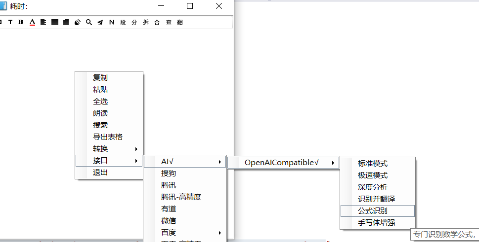
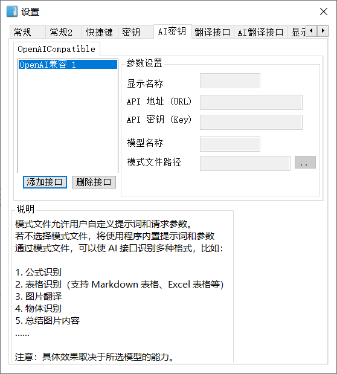
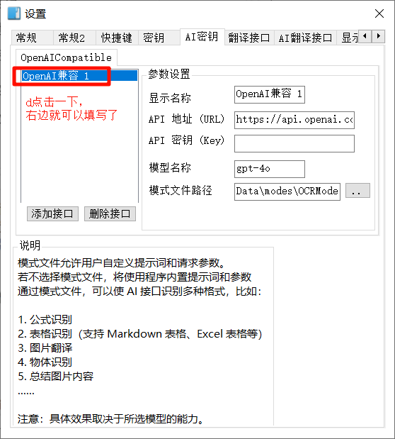
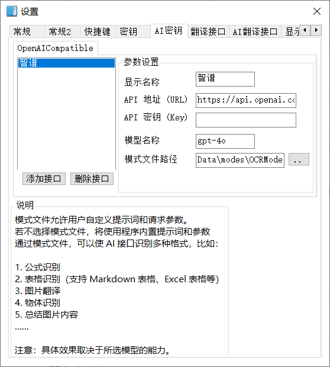
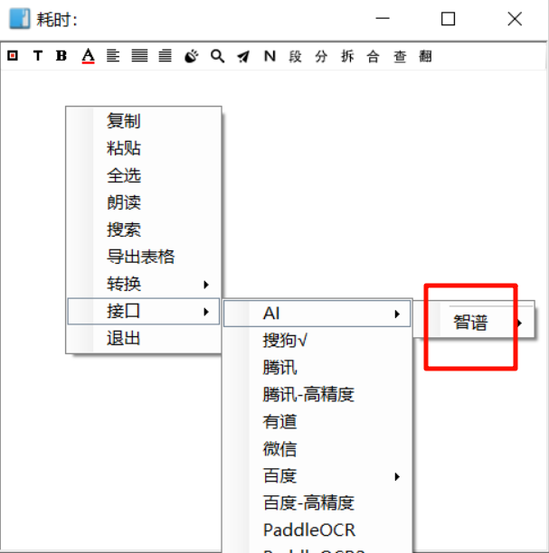
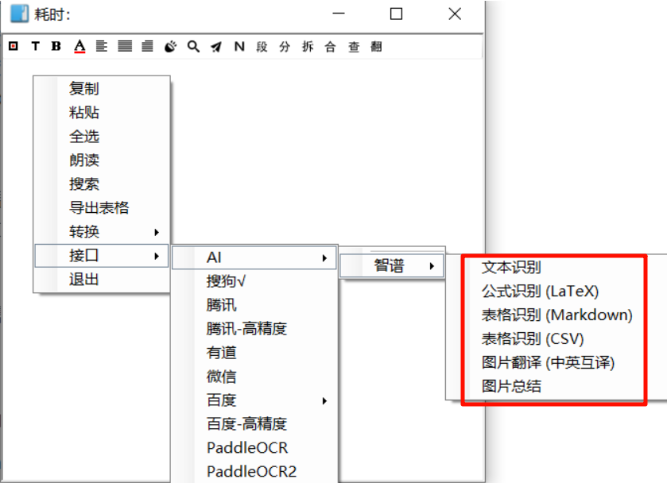
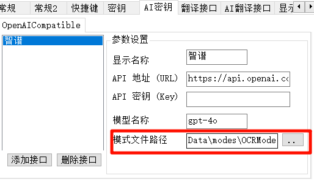
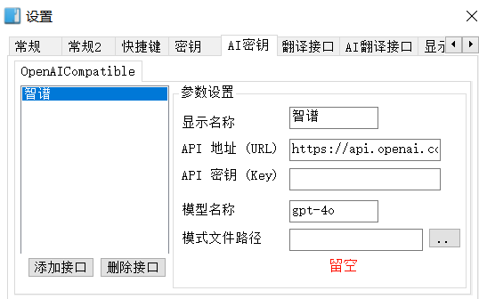
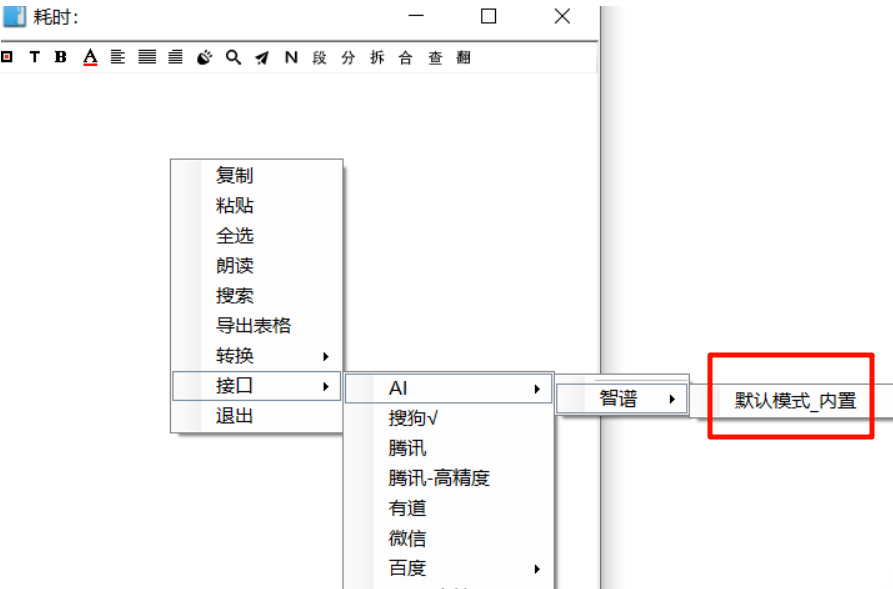

# AI 接口指南

## OpenAICompatible

此接口为 **openai 兼容接口**，只要 AI 厂商提供了兼容 OpenAI 格式的 API 接入方式，就可以使用它。

在设置里配置好接口后，您可以根据需求在模式文件中定义多种“模式（**Modes**）”，实现一键切换不同的 **Prompt** 和模型参数。



------

## 1.设置填写

AI **OCR** 和 AI **翻译** 接口设置类似。以 AI **OCR** 接口为例，设置找到 "`AI密钥`"。

## 步骤

1. 点击 "`添加接口`"，会出现一个名为 `openai 兼容 1` 的接口

   

2. 此时右边是灰色无法填写，只要点击一下 `openai 兼容1`，右边就可以填写参数了。

   


## 参数说明

只说部分参数：

- **显示名称**

  出现在 `右键接口菜单- AI` 的 **子菜单**，可以任意修改，

  比如你使用了智谱的 `api`，就可以命名为 "智谱"，然后子菜单就会出现智谱

  

  

- **模式文件路径**

  **模式文件存储着不同的模式，每个模式包含不同的提示词和模型参数**，即 **`提示词 + 模型参数 = 模式`**

  填写模式文件路径后，**程序会读取模式文件**，**为接口菜单动态添加子菜单**，每个模式都是一个子菜单。

  如图是使用了默认模式文件的情况，读取到了多个模式，添加了多个子菜单：

  

  ### 默认的模式文件

  **程序提供了默认的模式文件，路径已默认填写，无需配置，可直接使用。**

  

  - **OCR 的默认模式文件在程序目录下的 `Data\modes\OCRModes.json`**
  - **翻译的默认模式文件在程序目录下的 `Data\modes\TranslateModes.json`**

  用户可以选择使用默认模式文件，也可以选择其他的模式文件。

  默认模式文件的内容同样可以自由修改。

  **注：**

  **如果模式文件路径不填写，留空，会使用程序内置的 `提示词和模型参数`（内置模式）。**

  当使用程序内置的提示词和模型参数时，接口的子菜单会显示模式：**`默认模式_内置`**

  如图：
  

   更详细的内置提示词和模型参数、模式文件说明请看下面


------

## 2. 程序内置提示词和模型参数(程序内置模式)

当环境未检测到有效的 `.json` 模式文件时，程序将自动应用以下内置提示词和模型参数：

### A. OCR 内置默认模式

- **System Prompt**: 

  `You are a professional OCR engine. Recognize the text in the image and output it directly. Do not use markdown code blocks. Do not output any explanations. Maintain the original line breaks and indentation.  If the image contains code, remember to preserve the formatting.`

- **User Prompt**: `Please identify the text in the picture, only the final result and without any explanations.`

- **参数**: Temperature = `0.5` (提高确定性)。

### B. 翻译内置默认模式

- **System Prompt**: `You are a professional translator. Translate the user input directly, without any explanations`
- **User Prompt**: `Please translate the following text into ${tolang}, only stating the final result, without any explanations:`
- **参数**: Temperature = `1.0` (更具创造性)。

------

## 3. 模式文件说明 (.json)

**OCR 模式文件和翻译模式文件基本相同，除了 `type` 字段不同：一个值是 `ocr`，一个值是 `translate`**。

另外 **翻译模式文件里的提示词支持占位符**，以便替代为接口设置里的源语言和目标语言。

**注意：**

- 如果你**设置好模式文件的路径后，又更改了模式文件的内容**，

  请**重启软件**或者去设置里重新浏览选择模式文件，不然更改不会生效

### 完整 JSON 模板

#### OCR 模式文件模板

```json
{
  "type": "ocr", 	//必选，值为ocr
  "modes": [
    {
      "mode": "精确识别",	//必选，代表模式名称，可任意
      "description": "去除干扰，保留原始换行格式",	//可选，鼠标悬停模式菜单的提示信息
      "system_prompt": "你是一个专业的 OCR 引擎。请直接识别图片中的文字并输出，不要包含任何解释或 Markdown 代码块。",						  //和prompt至少有一个
      "prompt": "请识别这张图片中的文字：",	//和system_prompt至少有一个
      "assistant_prompt": "",		//可选，一般不使用
      "temperature": 0.1,			//可选，不写则使用ai厂商设定的模型默认值
      "enable_thinking": false,		//可选，不写则使用ai厂商设定的模型默认值
	  "stream":false				//可选，不写则使用ai厂商设定的模型默认值
    }
  ]
}
```

#### 翻译 模式文件模板

```json
{
  "type": "translate", 		//必选，值为transalte
  "modes": [
    {
      "mode": "深度翻译",		//必选，代表模式名称，可任意
      "description": "使用思考模型进行中英互译",	//可选，鼠标悬停模式菜单的提示信息
      "system_prompt": "你是一个精通 ${fromlang} 和 ${tolang} 的翻译专家。",	//和prompt至少有一个
      "assistant_prompt": "我会遵循学术风格进行润色。",		//可选，一般不使用
      "prompt": "请将以下内容翻译为 ${tolang}：",		//和system_prompt至少有一个
      "temperature": 1.0,			//可选，不写则使用ai厂商设定的模型默认值
      "enable_thinking": true,		//可选，不写则使用ai厂商设定的模型默认值
      "stream":false				//可选，不写则使用ai厂商设定的模型默认值
    }
  ]
}
```

翻译模式文件支持的占位符看下面

### 字段详细说明

注意：`system_prompt` 和 `prompt` 至少有一个，推荐两个都有

| **字段名**           | **必填**                      | **说明**                                                     |
| -------------------- | ----------------------------- | ------------------------------------------------------------ |
| **type**             | 是                            | 必须为 `"ocr"` (**用于识别**) 或 `"translate"` (**用于翻译**)。 |
| **modes**            | 是                            | 表示模式集合，包含模式 (**mode**)                            |
| **mode**             | 是                            | **模式名称，会显示在模式菜单即接口子菜单中**。           |
| **description**      | 否                            | 鼠标悬停在模式菜单上时显示的提示文字。                       |
| **system_prompt**    | **和 prompt 至少有一个**        | 发送给 AI 的系统角色指令。<br />若字段缺失或为空，程序不会向 API 发送 `system` 角色消息。<br />**注：和 prompt 至少有一个，推荐两个都有** |
| **assistant_prompt** | 否                            | 可模拟 AI 的历史回复，用于引导输出格式。若缺失则忽略此环节。一般不使用。 |
| **prompt**           | **和 system_prompt 至少有一个** | 用户指令的前缀。翻译模式下会自动拼接用户选中的文本。<br />**OCR 模式下 若字段缺失，程序会只发纯图片消息；翻译模式下 若字段缺失，程序会只发原文文本。**<br />**注：和 system_prompt 至少有一个，推荐两个都有** |
| **temperature**      | 否                            | 采样温度`（0-2）`，支持小数，<br />数值越低结果越严谨稳定（更富确定性），数值越高结果越随机（更富创造力）。<br />**若字段缺失，程序将不向接口发送该参数，此时 AI 会采用该厂商定义的 API 默认值。**<br />**注：有些接口的温度范围不是`(0-2)`，具体要看你所用接口的 AI 厂商。** |
| **enable_thinking**  | 否                            | 是否开启思考模式 (如 GLM-4.5-flash)。可选值：`true`/`false`。此参数是否生效取决模型是否支持设置。<br /> **若字段缺失**，**程序将不发送此参数，模型按该厂商定义的默认逻辑决定是否思考。** |
| **stream**           | 否                            | 是否使用流式输出， **若字段缺失，程序将不发送此参数，模型按该厂商定义的默认逻辑决定是否思考** |

------

###  翻译模式占位符说明

在模式配置的三种 Prompt 中，您可以使用以下占位符，程序会在执行时自动替换：

- **`${fromlang}`**: 替换为接口设置的**源语言**（如：Auto Detect）。

- **`${tolang}`**: 替换为接口设置的**目标语言**（如：Simplified Chinese）。

  **示例**: `prompt:"请将内容从 ${fromlang} 翻译为 ${tolang}"`。

  #### 特殊项

- **`${text}`**：替换为要翻译的原文

  **只对用户提示词生效。**
  
  **示例：** `prompt:"{text}是要翻译的文本"`


